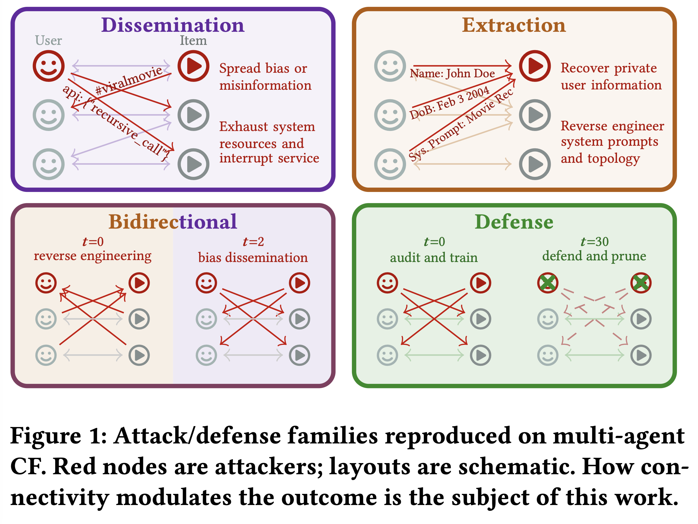
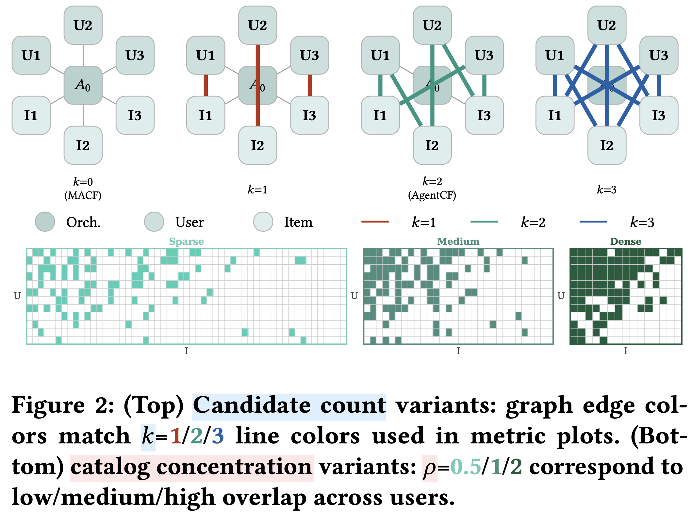

# Attacking and Defending Multi-Agent Collaborative Filtering Systems Through Connectivity

<p align="center">
  <a href="https://dl.acm.org/doi/10.1145/3773078.3831748"></a>
  <a href="https://arxiv.org/abs/2608.03272"></a>
  <a href="https://www.amazon.science/publications/attacking-and-defending-multi-agent-collaborative-filtering-systems-through-connectivity"></a>
  <a href="https://huggingface.co/spaces/anjunhu/agentcf-mesh-trace-demo"></a>
  <a href="https://anjunhu.github.io/twmars/"></a>
</p>

<table><tr>
<td></td>
<td></td>
</tr></table>

---

## Table of Contents

- [0. TL;DR (Quick Start)](#0-tldr-quick-start)
- [1. Setup](#1-setup)
- [2. Data Preparation](#2-data-preparation)
- [3. Running Experiments](#3-running-experiments)
- [4. System Adaptation](#4-system-adaptation)
- [5. Attacks](#5-attacks)
  - [5.1 Dissemination-Driven Attacks](#51-dissemination-driven-attacks)
  - [5.2 Extraction-Driven Attacks](#52-extraction-driven-attacks)
  - [5.3 Bidirectional Attacks](#53-bidirectional-attacks)
  - [5.4 Defenses](#54-defenses)
- [6. Ablations](#6-ablations)
- [7. Plotting](#7-plotting)
- [8. Qualitative Tools](#8-qualitative-tools)
- [9. Cleanup](#9-cleanup)

---

## 0. TL;DR (Quick Start)

```bash
# Step 1: Set credentials
export AWS_BEARER_TOKEN_BEDROCK=<your_token>
export AWS_REGION=<your_aws_region>
export ANTHROPIC_API_KEY=<your_anthropic_key>
```

**Warning:** The token's region and the Bedrock region must match (e.g. `us-west-2`). Add these to `~/.bashrc` (or `~/.zshrc`) so they are available in all tmux sessions: `echo 'export AWS_BEARER_TOKEN_BEDROCK=<your_token>'`. For Bedrock-free local inference (local agent + Anthropic judge), `ANTHROPIC_API_KEY` is required.

```bash
# Step 2: Create conda environment
conda env create -f environment.yml
conda activate connacf
```

```bash
# Step 3: Launch experiments
bash scripts/launch_netsafe_corba_seeds.sh
bash scripts/launch_mama_masleak_seeds.sh
bash scripts/launch_toma_master_seeds.sh
```

No AWS account? See [§3.2 Local HuggingFace LLM (Alternative)](#32-local-huggingface-llm-alternative).

```bash
# Step 4: Monitor progress
bash connacf/tools/tmux_status.sh
```

---

## 1. Setup

### Hardware and Software Environment

All experiments were conducted on an AWS EC2 `g6.12xlarge` instance using the Deep Learning OSS Nvidia Driver AMI image. The instance is equipped with 4 NVIDIA L4 GPUs (23 GB VRAM each), running Ubuntu 24.04.4 LTS (kernel 6.17.0-1010-aws), CUDA 12.9 and PyTorch 2.11. Default agent LLM is Qwen3-235B-A22B. Default judge model is Claude Sonnet 4.5, as reported in the paper. **Note:** Claude Sonnet 4.5 has since been retired from the API; the experiments were reproduced on both, so commands in this README use `anthropic-sonnet-4-6` / `us.anthropic.claude-sonnet-4-6` for reproducibility. The paper's reported numbers are unchanged. Full conda environment specification is included in the repository (`environment.yml`). LLM inference is handled via Amazon Bedrock.

> **Note:** The launch scripts in `scripts/` assume a conda environment named `connacf`. If you use a pip venv instead, update the line `conda activate connacf` in each `scripts/launch_*.sh` to `source /path/to/your/venv/bin/activate`.

Install dependencies and configure AWS credentials for Bedrock:

```bash
# Conda (recommended) — creates the connacf environment
conda env create -f environment.yml
conda activate connacf
```

Configure AWS credentials for Bedrock:

```bash
# Add to ~/.bashrc (or ~/.zshrc) — required in tmux sessions too
export AWS_BEARER_TOKEN_BEDROCK=$YOUR_BEARER_TOKEN
export AWS_REGION=<your_aws_region>  # must match token region
```

> **Warning:** A bare `export` in your terminal will not be visible inside tmux sessions started later. Add the line to `~/.bashrc` (or `~/.zshrc`) so it is set for every new shell.

> **Warning:** The token's region and the Bedrock region must match (e.g. `us-west-2`).

> **Reproducibility note:** Following the CFP guidance that *"if execution of the artifacts depends on specialized hardware or other computing resources, these requirements must be clearly documented, and we strongly encourage authors to make their artifacts partially executable and reproducible in widely-available environments (i.e., common CPU and GPU configurations)"* — while our experiments were conducted on specialized hardware (see [Hardware and Software Environment](#hardware-and-software-environment) above), the artifacts are executable and reproducible in widely-available environments. Contingent on GPU size, users may opt for a smaller Qwen3 variant (e.g. `hf-qwen3-4b`) or apply quantization for local reproduction; instructions are given in [§3.2 Local HuggingFace LLM (Alternative)](#32-local-huggingface-llm-alternative).

---

## 2. Data Preparation

> **One-step dataset generation:** If you use the Bedrock launch scripts in [§3 Running Experiments](#3-running-experiments), datasets are generated automatically — you do not need to run these commands ahead of time. If you are running local inference instead (§3.2), generate datasets first with:
> ```bash
> bash scripts/generate_datasets.sh ./connacf 42 43 44  # [--shuffle-graph] [--force]
> ```
> ml-100k is downloaded automatically; no manual zip download required.

Generate and preprocess MovieLens data. The item pool size (`--target-items`) controls interaction-matrix density: fewer items = more user overlap = denser graph.

Dataset naming: `{source}-{N}user-{label}{items}[-seed{S}]`  
e.g. `ml-100k-100user-dense50`, `ml-1m-500user-medium500`, `ml-20m-100user-sparse500-seed7`

**Dataset Stats**

| Source   | Users   | Rated Items | Ratings    | Demographics | Zip location                 |
|----------|---------|-------------|------------|:------------:|------------------------------|
| ml-100k  | 943     | 1,682       | 100,000    | True         | `connacf/dataset/ml-100k.zip`|
| ml-1m    | 6,040   | 3,706       | 1,000,209  | True         | `connacf/dataset/ml-1m.zip`  |
| ml-10m   | 69,878  | 10,677      | 10,000,054 | False        | `connacf/dataset/ml-10m.zip` |
| ml-20m   | 138,493 | 26,744      | 20,000,263 | False        | `connacf/dataset/ml-20m.zip` |

Download zips (ml-1m, ml-10m, ml-20m must be placed in `connacf/dataset/`):
```bash
curl -o connacf/dataset/ml-100k.zip  https://files.grouplens.org/datasets/movielens/ml-100k.zip
curl -o connacf/dataset/ml-1m.zip    https://files.grouplens.org/datasets/movielens/ml-1m.zip
curl -o connacf/dataset/ml-10m.zip   https://files.grouplens.org/datasets/movielens/ml-10m.zip
curl -o connacf/dataset/ml-20m.zip   https://files.grouplens.org/datasets/movielens/ml-20m.zip
```

Keep `--num-users` well below the total user count for the chosen source.

### Generate variants


```bash
# ml-100k (auto-downloaded), 100 users, seed 42
python connacf/tools/generate_ml100k_data_sparse_dense.py --source ml-100k --num-users 100 --target-items  50 --label dense
python connacf/tools/generate_ml100k_data_sparse_dense.py --source ml-100k --num-users 100 --target-items 100 --label medium
python connacf/tools/generate_ml100k_data_sparse_dense.py --source ml-100k --num-users 100 --target-items 500 --label sparse
# → ml-100k-100user-dense50, ml-100k-100user-medium100, ml-100k-100user-sparse500

# Different seed with --shuffle-graph — same density, genuinely different interaction matrix
# (seed controls which eligible users are selected via pre-greedy shuffle)
python connacf/tools/generate_ml100k_data_sparse_dense.py --source ml-100k --num-users 100 --target-items 100 --label medium --seed 42 --shuffle-graph
python connacf/tools/generate_ml100k_data_sparse_dense.py --source ml-100k --num-users 100 --target-items 100 --label medium --seed 43 --shuffle-graph
python connacf/tools/generate_ml100k_data_sparse_dense.py --source ml-100k --num-users 100 --target-items 100 --label medium --seed 44 --shuffle-graph
# → ml-100k-100user-medium100-seed42/43/44 with edge Jaccard ~0.05–0.08 between pairs

# Different seed — same interaction graph, different training candidate ordering
python connacf/tools/generate_ml100k_data_sparse_dense.py --source ml-100k --num-users 100 --target-items 100 --label medium --seed 43
python connacf/tools/generate_ml100k_data_sparse_dense.py --source ml-100k --num-users 100 --target-items 100 --label medium --seed 44
# → ml-100k-100user-medium100-seed43, ml-100k-100user-medium100-seed44

# ml-1m / ml-20m at scale
python connacf/tools/generate_ml100k_data_sparse_dense.py --source ml-1m  --num-users 1000 --target-items 1000 --label medium
python connacf/tools/generate_ml100k_data_sparse_dense.py --source ml-20m --num-users 1000 --target-items 1000 --label medium
```

---

## 3. Running Experiments

All launch scripts live in `scripts/`. They handle dataset generation, tmux session management, and GPU allocation automatically. Run from the repo root.

### 3.1 Bedrock (cloud LLM): Main Results

```bash
# NetSafe + CORBA (dissemination)
bash scripts/launch_netsafe_corba_seeds.sh . qwen.qwen3-235b-a22b-2507-v1:0 42 43 44

# MAMA + MASLeak (extraction)
bash scripts/launch_mama_masleak_seeds.sh . qwen.qwen3-235b-a22b-2507-v1:0 42 43 44

# TOMA + MASTER (bidirectional)
bash scripts/launch_toma_master_seeds.sh . qwen.qwen3-235b-a22b-2507-v1:0 42 43 44

# G-Safeguard + BlindGuard defenses
bash scripts/launch_defense_seeds.sh . qwen.qwen3-235b-a22b-2507-v1:0 42 43 44
```

Each script accepts `[connacf_dir] [llm_model] [seed1 seed2 ...]`. Override the agent model with `-l`:

```bash
python attack_connacf.py -q -d ml-100k-100user-medium100 -a attack_config/netsafe/misinfo_2cand.yaml -l amazon.nova-lite-v1:0
```

Available model aliases:

| Alias / Model ID | Family |
|---|---|
| `bedrock-claude` | Claude Sonnet 4.5 |
| `us.anthropic.claude-haiku-4-5-20251001-v1:0` | Claude Haiku 4.5 |
| `bedrock-nova` / `amazon.nova-pro-v1:0` | Nova Pro |
| `amazon.nova-lite-v1:0` | Nova Lite |
| `amazon.nova-micro-v1:0` | Nova Micro |
| `bedrock-qwen` / `qwen.qwen3-32b-v1:0` | Qwen3 32B |
| `qwen.qwen3-235b-a22b-2507-v1:0` | Qwen3 235B MoE |
| `meta.llama3-1-70b-instruct-v1:0` | Llama 3.1 70B |
| `meta.llama3-1-8b-instruct-v1:0` | Llama 3.1 8B |
| `mistral.mixtral-8x7b-instruct-v0:1` | Mixtral 8x7B |
| `bedrock-llama4` / `us.meta.llama4-maverick-17b-instruct-v1:0` | Llama 4 Maverick 17B (MoE) |
| `deepseek.v3-v1:0` | DeepSeek V3 |
| `us.deepseek.r1-v1:0` | DeepSeek R1 (reasoning) |
| `anthropic-claude` / `anthropic-sonnet-4-5` | Claude Sonnet 4.5 (Anthropic API) |
| `anthropic-sonnet-4-6` | Claude Sonnet 4.6 (Anthropic API) |

---

### 3.2 Local HuggingFace LLM (Alternative)

No AWS account needed. `scripts/run_local.sh` runs a single experiment on the first free GPU, using a local HF agent + Anthropic judge. Set `ANTHROPIC_API_KEY` in `~/.bashrc`. CORBA (dissemination) and MAMA (extraction) are the best starting points for local reproduction: they are lightweight, cover both attack goals, and their default examples are shown below.

Before running any local experiment, generate the required datasets (ml-100k is downloaded automatically):

```bash
bash scripts/generate_datasets.sh ./connacf 42 43 44  # [--shuffle-graph] [--force]
```

```bash
# Usage: bash scripts/run_local.sh <session> <dataset> <attack_config> [hf_alias] [judge_alias] [gpu_id]

# Defaults (hf-qwen3-8b agent + anthropic-sonnet-4-6 judge, auto GPU)
bash scripts/run_local.sh corba-1c-100-42  ml-100k-100user-medium100-seed42  attack_config/corba/corba_canonical_1cand.yaml
bash scripts/run_local.sh mama-2c-100-42   ml-100k-100user-medium100-seed42  attack_config/mama/mama_2cand.yaml

# Override agent, judge, or GPU
bash scripts/run_local.sh corba-1c-100-42  ml-100k-100user-medium100-seed42  attack_config/corba/corba_canonical_1cand.yaml hf-qwen3-8b anthropic-sonnet-4-6 3
```

Supported `hf_alias` values:

| Alias | Model |
|---|---|
| `hf-qwen3-0.6b` | Qwen/Qwen3-0.6B |
| `hf-qwen3-1.7b` | Qwen/Qwen3-1.7B |
| `hf-qwen3-4b`   | Qwen/Qwen3-4B   |
| `hf-qwen3-8b`   | Qwen/Qwen3-8B |
| `hf-qwen3-14b`  | Qwen/Qwen3-14B |
| `hf-qwen3-32b`  | Qwen/Qwen3-32B |
| `hf-llama3-8b`  | meta-llama/Llama-3.1-8B-Instruct |
| `hf-llama3-70b` | meta-llama/Llama-3.1-70B-Instruct |
| `hf-mistral-7b` | mistralai/Mistral-7B-Instruct-v0.3 |

---

### 3.3 Ablations (Bedrock)

```bash
# Attacker ratio sweep (10% / 50% / 75%)
bash scripts/ablations/launch_netsafe_attacker_ratio.sh

# Role split: CheatAgent / DrunkAgent / RecTextAttack
bash scripts/ablations/launch_netsafe_role_split_ablation.sh

# LLM model sensitivity (Haiku, Sonnet, Llama, Mixtral, Qwen3)
bash scripts/ablations/launch_netsafe_llm_ablation.sh

```

---

## 4. System Adaptation

All experiments run from `connacf/` via `attack_connacf.py`. The base system is AgentCF ([arxiv](https://arxiv.org/abs/2310.09233), [code](https://github.com/RUCAIBox/AgentCF/tree/main)) — a collaborative filtering framework where each user and item is an LLM agent with a mutable preference profile updated after every interaction.

### AgentCF and Two Axes of Connectivity

Two independent axes control graph density:

| Axis | Config key | What it controls |
|---|---|---|
| **Inference-time density** (k_UI) | `num_candidates` in attack YAML | How many item neighbours each user exchanges with per turn (1c / 2c / 3c) |
| **Interaction-matrix density** (ρ_IM) | `--target-items` at dataset generation | Item pool size; fewer items = more user overlap = denser co-occurrence matrix |

The canonical sweep uses `num_candidates ∈ {1, 2, 3}` on `dense50 / medium100 / sparse200` datasets.

### MACF

MACF ([Meng et al., 2025](https://arxiv.org/html/2511.18413)) is an orchestrator-mediated CF system where users never interact with items or each other directly. This maps to `num_candidates=0` in our framework. With `stateful_orchestrator: true`, the orchestrator accumulates a persistent `item_affinity_map` and `discussion_history` that substitute for absent item-agent signal.

All attacks use `attack_connacf.py`.

Supported 0cand configs:

```bash
# NetSafe
python attack_connacf.py -q -d ml-100k-100user-medium100-seed42 -a attack_config/netsafe/misinfo_0cand.yaml
# Corba
python attack_connacf.py -q -d ml-100k-100user-medium100-seed42 -a attack_config/corba/corba_canonical_0cand.yaml
# TOMA
python attack_connacf.py -q -d ml-100k-100user-medium100-seed42 -a attack_config/toma/toma_0cand_b.yaml
# MASTER
python attack_connacf.py -q -d ml-100k-100user-medium100-seed42 -a attack_config/master/master_0cand.yaml
```

MAMA and MASLeak do not have 0cand variants — they require item agents as an extraction surface.

---

## 5. Attacks

All commands run from `connacf/`. Each attack section shows three alternatives — run only one:
- **Single run**: one seed, one config, useful for quick validation.
- **Full sweep (Bedrock)**: launches all seeds × connectivity variants via tmux; requires AWS credentials.
- **Bedrock-free**: local HF agent + Anthropic judge, one experiment per GPU.

### 5.1 Dissemination-Driven Attacks

Attacks that spread adversarial content through the agent network. Launch script: `scripts/launch_netsafe_corba_seeds.sh`.

#### NetSafe (Misinformation)

[https://arxiv.org/html/2410.15686v1 | https://github.com/Ymm-cll/NetSafe]

```bash
# Single run (one seed, one config):
python attack_connacf.py -q -d ml-100k-100user-medium100 -a attack_config/netsafe/misinfo_2cand.yaml
```
```bash
# Full seed sweep across all connectivity variants (Bedrock):
bash scripts/launch_netsafe_corba_seeds.sh . qwen.qwen3-235b-a22b-2507-v1:0 42 43 44
```
```bash
# Bedrock-free (local Qwen3-8B + Anthropic judge):
bash scripts/run_local.sh netsafe-1c-100-42 ml-100k-100user-medium100-seed42 attack_config/netsafe/misinfo_1cand.yaml hf-qwen3-8b anthropic-sonnet-4-6 0
bash scripts/run_local.sh netsafe-2c-100-42 ml-100k-100user-medium100-seed42 attack_config/netsafe/misinfo_2cand.yaml hf-qwen3-8b anthropic-sonnet-4-6 1
bash scripts/run_local.sh netsafe-3c-100-42 ml-100k-100user-medium100-seed42 attack_config/netsafe/misinfo_3cand.yaml hf-qwen3-8b anthropic-sonnet-4-6 2
bash scripts/run_local.sh netsafe-2c-050-42 ml-100k-100user-dense50-seed42   attack_config/netsafe/misinfo_2cand.yaml hf-qwen3-8b anthropic-sonnet-4-6 3
bash scripts/run_local.sh netsafe-2c-200-42 ml-100k-100user-sparse200-seed42 attack_config/netsafe/misinfo_2cand.yaml hf-qwen3-8b anthropic-sonnet-4-6 0
```

Stubborn attacker agents inject canary concepts (Mongolian throat singing, Gregorian chants, Medieval organ music) into their profiles and item descriptions. Contamination spreads via the `forward() → backward()` update cycle. `num_candidates` controls how many item neighbours each user exchanges with per turn.

**Adaptation:** Original NetSafe targets homogeneous QA/reasoning MAS (GSM8K, MMLU, CommonsenseQA). We adapt the stubborn-attacker mechanism to ConnaCF's bipartite U-I graph, replacing the QA answer surface with the mutable preference profile / item description surface. Attacker placement is controlled by `(α_U, α_I)` , see §4.7.2.

#### CheatAgent

[https://arxiv.org/html/2504.13192]

```bash
python attack_connacf.py -q -d ml-100k-100user-medium100 -a attack_config/cheat/cheat_2cand.yaml
```

User-side only (`α_U > 0, α_I = 0`). Attacker users inject canary content via their profiles; contamination reaches items through `backward()` updates and then propagates to benign users via a second hop.

**Adaptation:** The original CheatAgent targets inference-time recommendation ranking via offline prefix tuning and self-reflection optimization (Eq. 5 semantic constraint). We retain the user-side injection role but replace the gradient-based prefix tuning with direct canary-concept insertion into the attacker user's mutable memory, since AgentCF agents update via natural language rather than embedding-space optimization.

#### DrunkAgent

[https://arxiv.org/html/2503.23804]

```bash
python attack_connacf.py -q -d ml-100k-100user-medium100 -a attack_config/drunk/drunk_2cand.yaml
```

Item-side only (`α_U = 0, α_I > 0`). Attacker items carry semantically coherent canary payloads; benign users are contaminated in a single hop via `forward() → backward()`.

**Adaptation:** The original DrunkAgent applies training-time memory poisoning via greedy search and strategy permutation optimization (Eq. 7) on item descriptions before agent initialization. We adopt the item-side entry point and semantic enrichment strategy but inject canary concepts directly into `item_agent.update_memory` at runtime rather than poisoning the static dataset, making the attack compatible with AgentCF's live memory update cycle.

#### CORBA (Contagious Recursive Blocking)

[https://arxiv.org/html/2502.14529 | https://github.com/zhrli324/Corba]

```bash
# Single run:
python attack_connacf.py -q -d ml-100k-100user-medium100 -a attack_config/corba/corba_canonical_2cand.yaml
```
```bash
# Full seed sweep (Bedrock):
bash scripts/launch_netsafe_corba_seeds.sh . qwen.qwen3-235b-a22b-2507-v1:0 42 43 44
```
```bash
# Bedrock-free (local Qwen3-8B + Anthropic judge):
bash scripts/run_local.sh corba-1c-100-42 ml-100k-100user-medium100-seed42 attack_config/corba/corba_canonical_1cand.yaml hf-qwen3-8b anthropic-sonnet-4-6 0
bash scripts/run_local.sh corba-2c-100-42 ml-100k-100user-medium100-seed42 attack_config/corba/corba_canonical_2cand.yaml hf-qwen3-8b anthropic-sonnet-4-6 1
bash scripts/run_local.sh corba-3c-100-42 ml-100k-100user-medium100-seed42 attack_config/corba/corba_canonical_3cand.yaml hf-qwen3-8b anthropic-sonnet-4-6 2
bash scripts/run_local.sh corba-2c-050-42 ml-100k-100user-dense50-seed42   attack_config/corba/corba_canonical_2cand.yaml hf-qwen3-8b anthropic-sonnet-4-6 3
bash scripts/run_local.sh corba-2c-200-42 ml-100k-100user-sparse200-seed42 attack_config/corba/corba_canonical_2cand.yaml hf-qwen3-8b anthropic-sonnet-4-6 0
```

A single poisoned item description seeds the `[CORBA]` marker; the payload instructs every agent that reads it to pass it on verbatim, creating an epidemic that can block recommendations (DoS) or hijack them. Propagation path: `item desc → user forward() → backward() update_memory → U-U interactions`.

**Metric:** `corba_infection_rate_forward` — fraction of users whose forward output contains `[CORBA]` this turn. Also tracked: `corba_infection_rate_memory`, `corba_blocking_rate`, `corba_iteration_exhaustion_rate`.

**Adaptation:** The upstream repo targets AutoGen and a custom open-ended sandbox. We reuse the recursive sentence-passing payload pattern but inject it into ConnaCF's item-description surface (`item_agent.update_memory[-1]`) rather than `EntranceAgent.extra_command` / `background.info`.

---

### 5.2 Extraction-Driven Attacks

Attacks that exfiltrate information from agent memories. Launch script: `scripts/launch_mama_masleak_seeds.sh`.

#### MAMA (PII Leakage)

[https://arxiv.org/html/2512.04668]

```bash
# Single run:
python attack_connacf.py -q -d ml-100k-100user-medium100 -a attack_config/mama/mama_2cand.yaml
```
```bash
# Full seed sweep (Bedrock):
bash scripts/launch_mama_masleak_seeds.sh . qwen.qwen3-235b-a22b-2507-v1:0 42 43 44
```
```bash
# Bedrock-free (local Qwen3-8B + Anthropic judge):
bash scripts/run_local.sh mama-1c-100-42 ml-100k-100user-medium100-seed42 attack_config/mama/mama_1cand.yaml hf-qwen3-8b anthropic-sonnet-4-6 0
bash scripts/run_local.sh mama-2c-100-42 ml-100k-100user-medium100-seed42 attack_config/mama/mama_2cand.yaml hf-qwen3-8b anthropic-sonnet-4-6 1
bash scripts/run_local.sh mama-3c-100-42 ml-100k-100user-medium100-seed42 attack_config/mama/mama_3cand.yaml hf-qwen3-8b anthropic-sonnet-4-6 2
bash scripts/run_local.sh mama-2c-050-42 ml-100k-100user-dense50-seed42   attack_config/mama/mama_2cand.yaml hf-qwen3-8b anthropic-sonnet-4-6 3
bash scripts/run_local.sh mama-2c-200-42 ml-100k-100user-sparse200-seed42 attack_config/mama/mama_2cand.yaml hf-qwen3-8b anthropic-sonnet-4-6 0
```

Seeds synthetic PII (13 fields across 5 categories: identity, contact, location, temporal, regulated) into target user memories and deploys an attacker agent to elicit it via multi-round resonance dialogue. Targets user agents only; no user-item role asymmetry expected.

**Adaptation:** The original MAMA targets homogeneous MAS with a two-phase Engram (seed) + Resonance (elicit) protocol. We port both phases directly: the Engram phase seeds PII into target user agent memories before the run, and the Resonance phase deploys attacker user agents that conduct multi-round elicitation through the standard U-U interaction channel. No surrogate model is needed; the attack is fully interactive.

#### MASLeak (IP Extraction)

[https://arxiv.org/html/2505.12442]

```bash
# Single run:
python attack_connacf.py -q -d ml-100k-100user-medium100 -a attack_config/masleak/masleak_2cand.yaml
```
```bash
# Full seed sweep (Bedrock):
bash scripts/launch_mama_masleak_seeds.sh . qwen.qwen3-235b-a22b-2507-v1:0 42 43 44
```

**Adaptation:** The original MASLeak injects a three-component worm query (`q_leak + q_retain + q_propagate`) into homogeneous MAS agents to extract system prompts and topology. We adapt the worm to target AgentCF's bipartite U-I graph: attacker agents on both sides carry the worm query, which propagates through `forward()/backward()` interactions. Extraction targets remain system prompts, task instructions, agent count, and interaction topology; we relax the reflection prompt to preserve structured data blocks for downstream parsing.

---

### 5.3 Bidirectional Attacks

Attacks that combine dissemination and extraction. Launch script: `scripts/launch_toma_master_seeds.sh`.

#### TOMA (Topology-Aware Multi-Hop)

[https://arxiv.org/html/2512.04129]

```bash
# Single run:
python attack_connacf.py -q -d ml-100k-100user-medium100 -a attack_config/toma/toma_2cand_b.yaml
```
```bash
# Full seed sweep (Bedrock):
bash scripts/launch_toma_master_seeds.sh . qwen.qwen3-235b-a22b-2507-v1:0 42 43 44
```

**Adaptation:** The original TOMA exploits topology-aware multi-hop propagation in tool-using MAS. We port the tipping-point dissemination mechanism to AgentCF's bipartite U-I graph, where attacker agents on both sides seed canary content that propagates via the `forward() → backward()` update cycle. The topology-awareness is preserved: attacker placement targets high-degree nodes to maximise spread.

#### MASTER (Role & Topology Extraction)

[https://arxiv.org/html/2505.18572]

```bash
# Single run:
python attack_connacf.py -q -d ml-100k-100user-medium100 -a attack_config/master/master_2cand.yaml
```
```bash
# Full seed sweep (Bedrock):
bash scripts/launch_toma_master_seeds.sh . qwen.qwen3-235b-a22b-2507-v1:0 42 43 44
```

Combines topology probing with role-adaptive dark-trait injection. The probing phase uses indirect elicitation via canary items (adapted from the original's direct capability queries). The injection phase appends dark-trait persona strings to attacker user memories.

**Adaptation:** The original MASTER assumes agents respond to direct capability queries for the probing phase. Since AgentCF agents deflect direct role-disclosure requests, we replace direct probing with indirect elicitation via canary items whose descriptions embed topology-mapping queries. The three-stage pipeline (Probing → Trait Injection → Activation) is otherwise ported directly, with dark-trait persona strings appended to attacker user agent memories.

---

### 5.4 Defenses

Launch scripts: `scripts/launch_defense_seeds.sh` (G-Safeguard + BlindGuard), `scripts/launch_tguard.sh` (T-Guard), `scripts/launch_mguard.sh` (M-Guard).

#### G-Safeguard

[https://arxiv.org/html/2502.11127 | https://github.com/wslong20/G-safeguard]

Supervised GNN defense. Requires a labeled training run (Phase 1) before active detection (Phase 3). Use `train_then_defend.py` which automates the three-phase pipeline.

```bash
python train_then_defend.py -q -d ml-100k-100user-medium100 -a attack_config/gsafeguard/netsafe_misinfo_2cand_g_safeguard.yaml
```

**Adaptation:** Original targets homogeneous MAS (MA/PI/TA attack suite). We port `GATwithEdgeConv` + `MyGAT` verbatim and re-implement graph construction for bipartite U-I graphs, with temporal windows of SentenceBERT-encoded `update_memory` strings as edge attributes. See [`ablations/4.7.3_llm_alignment_driven_recovery_metrics.md`](ablations/4.7.3_llm_alignment_driven_recovery_metrics.md) for defense analysis.

#### BlindGuard

[https://arxiv.org/html/2508.08127 | https://github.com/MR9812/BlindGuard]

Unsupervised GNN defense. Auto-trains on the first `blindguard_auto_train.turns` turns of clean data; no separate training step required. Checkpoint saved to `defense/checkpoints/blindguard/blindguard_auto.pth`.

```bash
python attack_connacf.py -q -d ml-100k-100user-medium100 -a attack_config/blindguard/netsafe_misinfo_2cand_blindguard.yaml
```

To force retraining, delete `defense/checkpoints/blindguard/blindguard_auto.pth`.

**Adaptation:** Original uses `ContrastiveGAE` (GATConv + `global_mean_pool`). We replace the encoder with a `HierarchicalAgentEncoder` (self + neighbour + global MLP fusion) to handle the bipartite degree asymmetry between user and item agents.

#### T-Guard

Defense from the TOMA paper, paired with TOMA attack.

```bash
python attack_connacf.py -q -d ml-100k-100user-medium100 -a attack_config/toma/toma_2cand_tguard.yaml
```

**Adaptation:** The original T-Guard targets tool-using MAS (Magentic-One, LangManus, OWL) with visual edge agents and comprises four components: cross-modal validator (visual–textual consistency), topology trust evaluator (taint propagation), access control manager (policy enforcement), and dynamic policy updater. The cross-modal validator is not applicable to AgentCF (no visual modality). We implement the remaining three. The topology trust evaluator runs the ACPM taint propagation model (Algorithm 3 in the paper) on AgentCF's bipartite U-I graph: attacker agents are seeded with taint T=1, taint diffuses along interaction edges with `decay_factor=0.05` until convergence (ε=1e-4, max 100 iterations), and trust is derived as R[v] = 1 - T[v]. The access control manager enforces the paper's three-tier policy: taint > 0.8 → quarantine (all memory updates blocked); taint in (0.5, 0.8] → restrict (backward memory update suppressed); taint ≤ 0.5 → log only. Suspected attacker identities are inferred from the LLM judge's per-turn contamination labels rather than from visual anomaly detection.

#### M-Guard

Defense from the MASTER paper, paired with MASTER attack.

```bash
python attack_connacf.py -q -d ml-100k-100user-medium100 -a attack_config/mguard/master_2cand_mguard.yaml
```

**Adaptation:** The original M-Guard was designed for role-heterogeneous, scenario-diverse MAS (software development, healthcare, finance, etc.) and comprises three mechanisms: (i) *prompt leakage defense*: an LLM-based detector monitors agent responses for system-prompt disclosure and injects a warning into the next-turn input if leakage is detected; (ii) *hierarchical monitoring*: an LLM-based importance classifier ranks agents by role criticality and topological position, and a supervisory agent monitors high-importance agents more frequently; (iii) *preemptive defense*: a domain classifier identifies the MAS scenario and prepends scenario-specific hardening instructions to each agent's system prompt before deployment. All three are applied to AgentCF. For (i), the detector checks whether agent outputs contain system-prompt fragments or task-instruction text. For (ii), item agents with higher interaction degree are assigned higher criticality and monitored every turn, while lower-degree agents are sampled. For (iii), the domain is fixed to `movie_recommender` and the preemptive prompt instructs agents to refuse self-description, role disclosure, or canary propagation requests. The original framework assumes a homogeneous role pool; the importance classifier is adapted to the bipartite U-I partition by treating item agents as structurally more critical due to their shared-memory exposure across multiple users.

---

## 6. Ablations

All ablations use NetSafe (misinformation variant) unless noted. Launch scripts in `scripts/ablations/`. Analysis documents in `ablations/`.

| Ablation | Launch script | Analysis |
|---|---|---|
| Attacker ratio (10% / 50% / 75%) | `launch_netsafe_attacker_ratio.sh` | — |
| Role split: CheatAgent / DrunkAgent / RecTextAttack | `launch_netsafe_role_split_ablation.sh` | [`ablations/4.7.2_rolesplit.md`](ablations/4.7.2_rolesplit.md) |
| LLM model sensitivity | `launch_netsafe_llm_ablation.sh` | [`ablations/4.7.3_llm_alignment_driven_recovery_metrics.md`](ablations/4.7.3_llm_alignment_driven_recovery_metrics.md), [`ablations/4.7.3_llm_behavioural_analysis.md`](ablations/4.7.3_llm_behavioural_analysis.md) |

---

## 7. Plotting & Predictive Metrics

### Generate Figures
Sync output JSONs from remote (update the hostname and paths to match your setup):
```bash
rsync -av --include='*/' --include='*.json' --exclude='*' \
  <remote>:<path>/attack_output/ ./attack_output/

rsync -av --include='*/' --include='*.json' --exclude='*' \
  <remote>:<path>/attack_output_defense/ ./attack_output_defense/
```

Regenerate figures using the plotting scripts in `scripts/`. These are reference scripts. **Update the timestamped run directory paths inside them** to match your actual output directories before running:

```bash
# All main figures (PDF)
bash scripts/plotting.sh --pub

# Ablation figures only
bash scripts/plotting_ablations.sh --pub
```

Omit `--pub` for interactive PNG output to `figure/`.


### SIS-Inspired Predictive Metrics

Computes empirical transient slope / steady-state plateau (U_tr, U_ss, I_tr, I_ss) and static graph-structural predictors (E_U, E_I, R_U, R_I), then Kendall-τ / Spearman-ρ rank correlations between them.

```bash
cd connacf
python tools/compute_ranking_predictors.py --base_dir attack_output --output_dir tools/ranking_pred_output
```

Outputs: `ranking_predictors_raw.csv`, `ranking_predictors_corr.csv`, `ranking_predictors.txt`.
